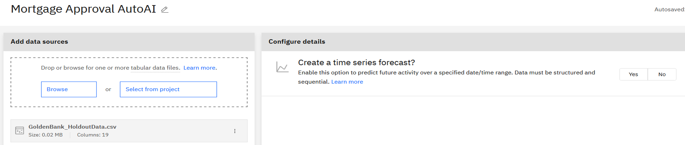
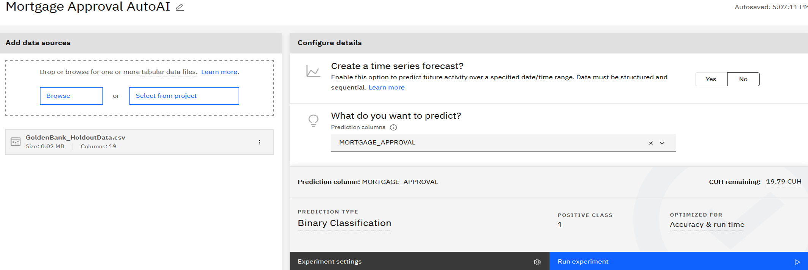
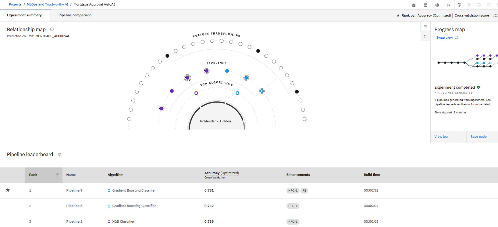
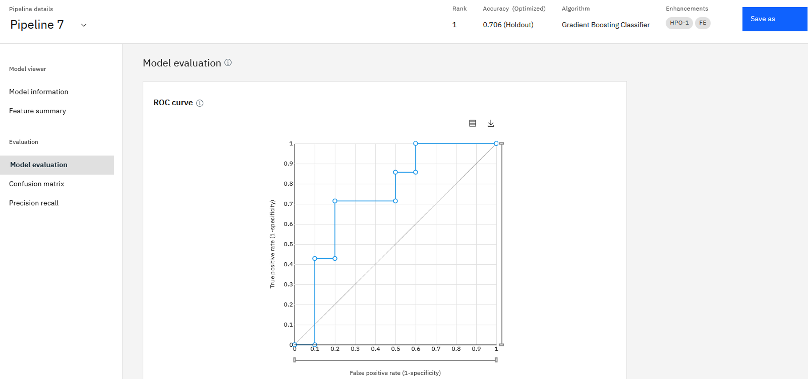
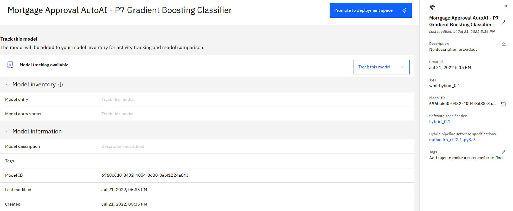
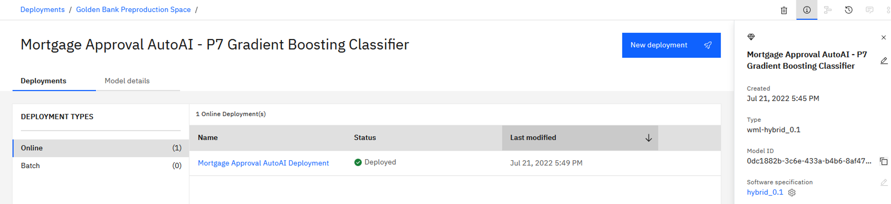
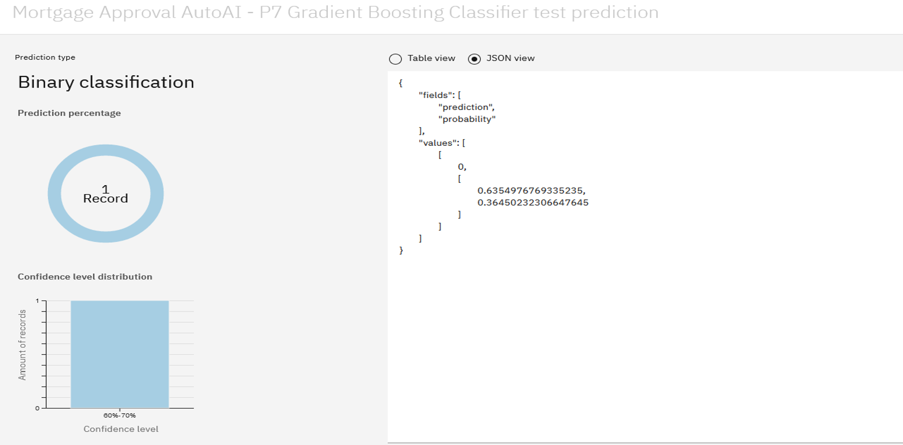

# Build, Deploy, and Run a Machine Learning Model with AutoAI

## Tutorial Scenario
Golden Bank is a leading mortgage provider through their network of neighborhood branches. This tutorial cover these goals:
- The bank uses AI to process loan applications and needs to avoid unanticipated risk and ensure that its applicants are being treated fairly.
- The bank has sample data in a file and wants to create a prediction model to identify the highest value customers to target for mortgage offerings with minimum development resources and time.

## Exercise: Create AutoAI Experiment
1. Associate machine learning service with project
    1. If you haven't created required services and the sample project, go to the [previous session](../build-and-deploy-with-studio/README.md) and complete **Prepare Services** and **Create Project**.
    2. From the Cloud Pak for Data navigation menu, choose **Projects > View all projects**.
    3. Open the **MLOps and Trustworthy AI** project.
    4. From the **Manage** tab, choose **Services & integrations**.
    5. Click **Associate service**.
    6. Select the machine learning service and click **Associate**.
2. Create the AutoAI experiment
    1. From the **Assets** tab, click **New asset**.
    2. Click **AutoAI**.
    3. Enter “**Mortgage Approval AutoAI**” as name and click **Create**.
3. Add a data source to the experiment
    1. We need to add a data source the experiment and configure AutoAI to build and train models based on the data source
    2. Click **Select from project** to add a data source.
    3. Click **Data asset** and check **GoldenBank_HoldoutData.csv**.
    4. Click **Select asset**.
4. Verify your screen looks like the following image.

    

## Exercise: Configure AutoAI Experiment
1. Configure the AutoAI experiment
    1. Now we need to configure the experiment.
    2. Click **No** for Create a time series forecast?
    3. Choose **MORTGAGE_APPROVAL** for What do you want to predict?
    4. Click **Experiment settings**.
    5. We are doing a binary classification so leave the default prediction type checked.
    6. We use the default settings:
        - Positive class value: 1
        - Optimized metric: Accuracy
        - Optimized algorithm selection: Score and run time
    7. Scroll down to select **Gradient Boosting Classifier** and **XGB Classifier** as the algorithms for the experiment to run.
    8. Make sure 2 is highlighted and click **Save settings**.
2. Verify your screen looks like the following image.

    

## Exercise: Run AutoAI Experiment
1. Run the AutoAI experiment
    1. Click **Run Experiment**.
    2. It will next take a few minutes to run through various pipelines.
    3. Click the pipelines on the Relationship map and Pipeline leaderboard to see more information.

2. Verify your screen looks like the following image.

    

## Exercise: Review Pipeline Details
1. Review the pipeline details
    1. Click the top ranked pipeline, Pipeline 7, with Gradient Boosting Classifier, plus hyperparameter optimization and feature engineering.
    2. Check **Model information**.
    3. Check **Feature summary**.
    4. Check **Model evaluation**.

2. Verify your screen looks like the following image.

    

## Exercise: Save Pipeline as a Model
1. Save the pipeline
    1. Click **Save as**.
    2. Take the default values and click **Create**.
    3. Click **View in project** after the model is saved successfully.
    4. Now we have a new model created by AutoAI, ready to be deployed.

2. Verify your screen looks like the following image.

    

## Exercise: Promote and Deploy Model
1. Promote the model to a deployment space
    1. Click **Promote to deployment space**.
    2. For the Target space, select “**Golden Bank Preproduction Space**”, which is created in the previous session.
    3. Check the **Go to model in the space after promoting it** option.
    4. Click **Promote**.
2. Create an online deployment for the model
    1. On the deployment space screen, click **New deployment**.
    2. For the Deployment type, select **Online**.
    3. For the Name, enter “**Mortgage Approval AutoAI Deployment**” with no leading or trailing spaces.
    4. For the Serving Name, enter “**mortgage_approval_autoai**”, append some characters to make it unique if name is taken.
    5. Click **Create**.
3. Verify your screen looks like the following image.

    

## Exercise: Run the Model
1. Make a prediction request to the model – use json
    1. Click **Mortgage Approval AutoAI Deployment**.
    2. On the **Test** tab, click **Paste JSON**.
    3. Click **Browse local files**.
    4. Click [**GoldenBank_AutoAIData.json**](./GoldenBank_AutoAIData.json) which you downloaded from the this repo and **Confirm**.
    5. Click **Predict** to make a prediction request for the entry in json.
    6. It comes back with prediction of **0 and 64%** confidence.
    7. Feel free to change some values and see if prediction results would be different.
2. Verify your screen looks like the following image.

    

