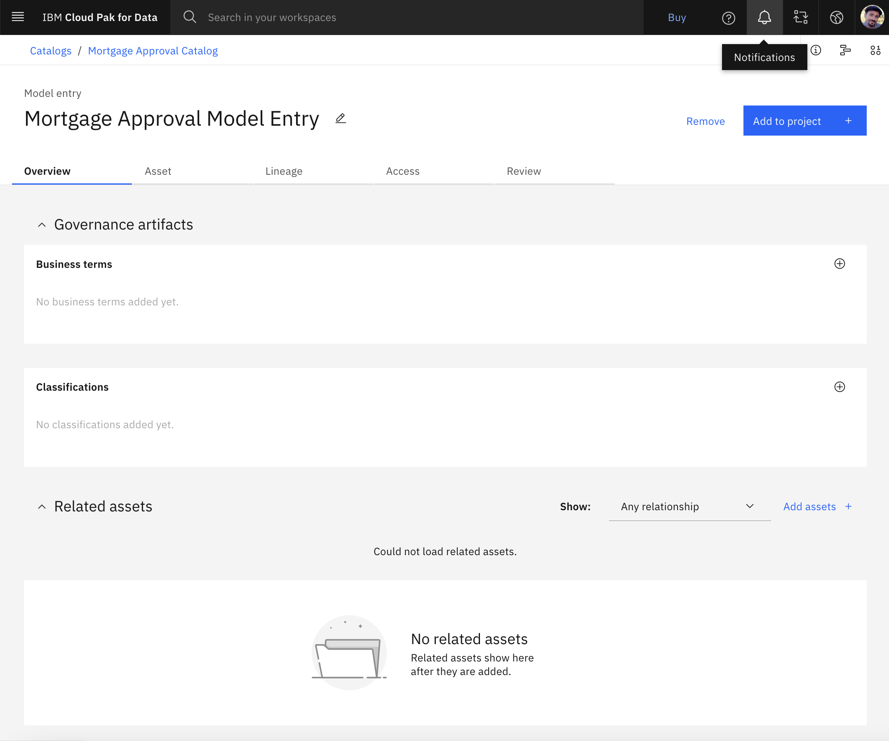

# Build, Deploy, and Run a Machine Learning Model using Watson Studio Notebook

## Tutorial Scenario

Golden Bank is a leading mortgage provider through their network of neighborhood branches. This tutorial cover these goals:
- The bank uses AI to process loan applications and needs to avoid unanticipated risk and ensure that its applicants are being treated fairly.
- Based on a new regulation, the bank cannot lend to underqualified loan applicants. The bank has existing data for loan applications in a Db2 Warehouse. The bank needs to use the data to train AI models without moving it.
- The bank wants to run a campaign to offer lower mortgage rates. The bank needs a consolidated view of applicants to identify the highest value customers to target and help to determine the best rates to offer them.

## Table of Contents

- [Prerequisite: Prepare Services](#prerequisite-prepare-services)
- [Exercise 1: Create Project](#exercise-1-create-project)
- [Exercise 2: Set up Tracking](#exercise-2-set-up-tracking)
- [Exercise 3: Build and Save a Model](#exercise-3-build-and-save-a-model)
- [Exercise 4: View Model’s AI Factsheet](#exercise-4-view-models-ai-factsheet)
- [Exercise 5: Associate the Model with a Model Entry](#exercise-5-associate-the-model-with-a-model-entry)
- [Exercise 6: Promote Model to Deployment Space](#exercise-6-promote-model-to-deployment-space)
- [Exercise 7: Deploy the Model](#exercise-7-deploy-the-model)
- [Exercise 8: Run the model](#exercise-8-run-the-model)

## Prerequisite: Prepare Services

Before we begin, we need to make sure we have the required services for the exercise. If you
followed the [sign-up](/sign-up/README.md) process all required services should have been
provisioned. Follow the steps below to verify or create missing services.

1. Log into your **[IBM Cloud account](https://cloud.ibm.com/)**.
2. From the navigation menu in the top left corner, scroll down and choose **Cloud Pak for Data > [Services](https://cloud.ibm.com/cloudpaks/data/services)**.
3. Click **[Launch Cloud Pak for Data](https://dataplatform.cloud.ibm.com/home2?context=cpdaas)**.
4. From the Cloud Pak for Data navigation menu in the top left corner, choose **Services > [Service instances](https://dataplatform.cloud.ibm.com/data/services?target=services&context=cpdaas)**.
5. Use the **Product** drop-down list to determine whether there is an existing Watson Studio service instance.
6. If you need to create a Watson Studio service instance, click **[Add service](https://dataplatform.cloud.ibm.com/data/catalog?target=services&context=cpdaas)**.
7. Select **[Watson Studio](https://dataplatform.cloud.ibm.com/data/catalog/data-science-experience?context=cpdaas&target=services)**.
    1. Select **Dallas** as the region.
    2. Select the **Lite** plan.
    3. Select the **Default** resource group.
    4. Click **Create**.
8. Repeat these steps to verify or provision the following additional [services](https://dataplatform.cloud.ibm.com/data/catalog?target=services&context=cpdaas).
    - **[Machine Learning](https://dataplatform.cloud.ibm.com/data/catalog/pm-20?context=cpdaas&target=services)**.
    - **[Watson Knowledge Catalog](https://dataplatform.cloud.ibm.com/data/catalog/datacatalog?context=cpdaas&target=services)**.
    - **[Cloud Object Storage](https://cloud.ibm.com/objectstorage/create)**.
9. Verify your screen looks like the following image.
   

## Exercise 1: Create Project

Create the sample project for the exercise:

1. Login to [IBM Cloud Pak for Data](https://dataplatform.cloud.ibm.com/login?context=cpdaas)
   - Select "Dallas" under "Work with resources in this IBM Cloud region"
2. From the navigation menu in the top left corner select **[Gallery](https://dataplatform.cloud.ibm.com/gallery?context=cpdaas&query=trust)**.
3. Type "MLOps" in the search box and click on the [MLOps and Trustworthy AI](https://dataplatform.cloud.ibm.com/exchange/public/entry/view/48e9f342365736c7bb7a8dfc48e6245e?context=cpdaas) guided tutorial sample project.
4. Click **Create project**.
5. Take the default name and select your Cloud Object Storage instance from the list.
6. Click **Create** and then **View new project** 
7. Close the popup window and select the **Assets** tab to verify your project looks like the following image:
   

## Exercise 2: Set up Tracking

1. Set up tracking for your model in Watson Knowledge Catalog:
    1. From the IBM Cloud Pak for Data navigation menu, choose **Catalogs > [View all catalogs](https://dataplatform.cloud.ibm.com/data/catalogs/?context=cpdaas)**. 
    2. Click **Create Catalog**.
    3. Enter the catalog name as “**Mortgage Approval Catalog**” with no leading or trailing spaces.
    4. Select your **IBM Cloud Object Storage** from the list for the catalog assets.
    5. Select **Enforce data policies**, confirm the selection, and accept the defaults for the other fields.
    6. Click **Create**.
2. Create model entry in the model inventory:
    1. From the IBM Cloud Pak for Data navigation menu, choose **Catalogs > [Model Inventory](https://dataplatform.cloud.ibm.com/aigov/modelinventory?context=cpdaas)**. 
    2. Click **New model entry**.
    3. Enter the model entry name as “**Mortgage Approval Model Entry**” with no leading or trailing spaces.
    4. Click **Save**.
    5. Verify your model entry looks like the following image.
       

## Exercise 3: Build and Save a Model

We will run the first notebook in the sample project in order to ...:
 - Set up AI Factsheets used to track the lifecycle of the mode.
 - Load the training data.
 - Specify the target, categorical, and numerical columns along with the thresholds used to build the model.
 - Build data pipelines.
 - Build machine learning models.
 - View the model results.
 - Save the model.

 1. From the IBM Cloud Pak for Data navigation menu, choose **Projects > [View all projects](https://dataplatform.cloud.ibm.com/projects/?context=cpdaas)**.
 2. Open the **MLOps and Trustworthy AI** project. 
 3. On the **Assets** tab, click **Source Code > Notebooks**.
 4. Open the **1-model-training-with-factsheets** notebook. 
 5. Since the notebook is in read-only mode, click the **Edit** (pencil) icon to place the notebook in edit mode.
 6. Under the **Provide your IBM Cloud API key** section, you need to pass your credentials to the Machine Learning API service.
    - If you don't already have a saved [API key](https://cloud.ibm.com/iam/apikeys), follow the instructions in notebook to create an API key.
 7. Update the cell `ibmcloud_api_key = ''` with your API key.
 8. To run all the cells in the notebook, click **Cell > Run All**. Alternatively, you can run the notebook cell by cell if you want to explore each cell and its output.
 9. Take a few minutes to review the steps to build, train, verify, and save this random forest model.
10. After the last notebook cell is finished and the model is stored, click **File > Stop Kernel** and confirm to shut down the kernel.

You just built and saved a model “**Mortgage Approval Prediction Model**” to your project.

## Exercise 4: View Model’s AI Factsheet

View the model’s **[AI Factsheet](https://community.ibm.com/community/user/datascience/blogs/shashank-sabhlok/2022/01/23/ai-factsheets-on-cloud-pak-for-data-as-a-service-a)**:

 1. From the Cloud Pak for Data navigation menu, choose **Projects > [View all projects](https://dataplatform.cloud.ibm.com/projects/?context=cpdaas)**.
 2. Open the **MLOps and Trustworthy AI** project. 
 3. On the **Assets** tab, click **Models > Models**.
 4. Open **Mortgage Approval Prediction Model** that you previously created.
 5. Review the AI [Factsheet](https://dataplatform.cloud.ibm.com/docs/content/wsj/analyze-data/factsheets-viewing.html?audience=wdp#model-factsheet) for your model.
 6. Scroll to the **Training metrics and Training tags** sections to review the captured training metadata.
 7. Verify your screen looks like the following image.
    

## Exercise 5: Associate the Model with a Model Entry

We need to associate the model with a model entry.

1. Scroll up on the model page, and click **Track this model**. 
   1. In the pop-up dialog box, choose **Select an existing model entry**.
   2. From the list of model entries, select **Mortgage Approval Model Entry**.
   3. Click **Track** to close the dialog box
2. Back on the model page, click **Open in [model inventory](https://dataplatform.cloud.ibm.com/aigov/modelinventory?context=cpdaas)**.
3. On the **Model entry** page, click the **Asset** tab.
4. Under **Model tracking**, you can see that AI Factsheets track models through their lifecycle.
   This model is still in the **Develop** stage as it has not been deployed yet.
5. Verify your screen looks like the following image.
   

## Exercise 6: Promote Model to Deployment Space

Before you can deploy the model, you need to promote the model to a new deployment space.

 1. From the IBM Cloud Pak for Data navigation menu, choose **Catalogs > [Model inventory](https://dataplatform.cloud.ibm.com/aigov/modelinventory?context=cpdaas)**.
 2. For the Mortgage Approval Model Entry, click **View details**.
 3. Click **Asset** tab.
 4. From the model entry, under the **Develop** phase, click **Mortgage Approval Prediction Model**.
 5. Click **Open in project** to open the model in the MLOps and Trustworthy AI project.
 6. On the model page, click **Promote to deployment space**.
 7. For the Target space, select **Create a new deployment space**.
 8. For the deployment space name, enter “**Golden Bank Preproduction Space**” with no leading or trailing spaces.
 9. Select your storage service from the list.
10. Select your provisioned machine learning service from the list.
11. Click **Create** and after the deployment space is ready click **Close**.
12. For the **Target space**, ensure that **Golden Bank Preproduction Space** is selected.
13. Check the **Go to model in the space after promoting it** option.
14. Click **Promote**.

## Exercise 7: Deploy the Model

Create an online deployment for the model.

 1. On the deployment space screen, click **New deployment**.
 2. For the Deployment type, select **Online**.
 3. For the Name, enter "**Mortgage Approval Model Deployment**" with no leading or trailing spaces.
 4. For the Serving Name, enter “**mortgage_approval_service_<your_unique_id>**”, append some characters to make it unique if name is taken.
 5. Click **Create**.
 6. Navigate to **Catalogs > Model inventory**.
 7. For the Mortgage Approval Model Entry, click **View details**.
 8. Click the **Asset** tab. Under Model tracking, you can see that the model is now in the **Deploy** stage. 
 9. Verify your model entry looks like the following image.
    

## Exercise 8: Run the model

Make predictions using the deployed model.

1. Add the test dataset to the deployment space
   1. Download the test dataset [**GoldenBank_TestData.csv**](./GoldenBank_TestData.csv) from this repo.
      1. Click "Raw" in the top right corner above the CSV content view
      2. From your browser "File" menu, click "Save page as" to store a local copy of the CSV file
   2. From the Cloud Pak for Data navigation menu, click **Deployments**
   3. Select the **[Spaces](https://dataplatform.cloud.ibm.com/ml-runtime/spaces?context=cpdaas)** tab and
      click on "**Golden Bank Preproduction Space**" from the list of Deployments
   4. Click on "**Drop files here or browse for files to upload**" to upload the test dataset.
   5. Verify that the test dataset CSV file appears under **Data assets** on the **Assets** tab.
2. Open model deployment in the deployment space.
   1. Click **Deployments** tab.
   2. Click **Mortgage Approval Model Deployment**.
3. Make a prediction request to the model - using a dataset CSV file
   1. On the **Test** tab, click **Search in space**.
   2. Click **Data asset**.
   3. Click **GoldenBank_TestData.csv** and **Confirm**.
   4. Click **Predict** to make prediction requests for 168 entries in the test dataset.
   5. Verify your screen looks like the following image.
      
   6. Close the Prediction results dialog.
4. Make a prediction request to the model – using a local JSON file
   1. Download the test json file [**GoldenBank_TestData.json**](./GoldenBank_TestData.json) from this repo.
      1. Click "Raw" in the top right corner above the JSON content view
      2. From your browser "File" menu, click "Save page as" to store a local copy of the JSON file 
   2. Under "Enter input data", click **Paste JSON**.
   3. Click **Browse local files** and select the "**GoldenBank_TestData.json**" downloaded in the previous step.
   4. Click **Predict** to make a prediction request for the entry in json.
   5. You should see the Binary classification result for 1 Record, i.e. a prediction of **0 and 94%** confidence.
   6. Close the result dialog
   7. Repeat the steps to "**Browse local files**", scroll down the json editor and change the following values: 
      - 3rd value from `10` to `30` (`YRS_WITH_CURRENT_EMPLOYER`)
      - 5th value from `2000` to `200` (`CREDITCARD_DEBT`)
   8. Verify your screen looks like in this screenshot
      
   9. Click **Predict** to make a prediction request for the entry in json.
   10. Now you should see a prediction of **1** with a high confidence around **80%**.
