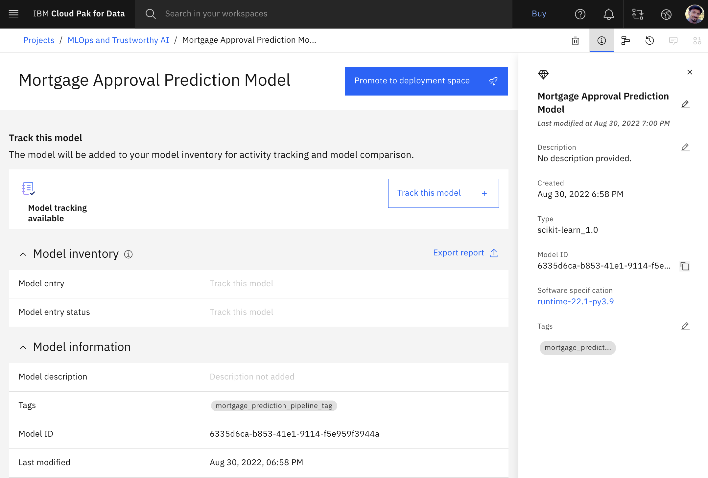

# Build, Deploy, and Run a Machine Learning Model using Watson Studio Notebook

## Tutorial Scenario
Golden Bank is a leading mortgage provider through their network of neighborhood branches. This tutorial cover these goals:
- The bank uses AI to process loan applications and needs to avoid unanticipated risk and ensure that its applicants are being treated fairly.
- Based on a new regulation, the bank cannot lend to underqualified loan applicants. The bank has existing data for loan applications in a Db2 Warehouse. The bank needs to use the data to train AI models without moving it.
- The bank wants to run a campaign to offer lower mortgage rates. The bank needs a consolidated view of applicants to identify the highest value customers to target and help to determine the best rates to offer them.

## Exercise: Prepare Services
1. Create the required service for the exercise
    1. From the Cloud Pak for Data navigation menu, choose **Services > Service instances**.
    2. Use the **Product** drop-down list to determine whether there is an existing Watson Studio service instance.
    3. If you need to create a Watson Studio service instance, click **Add service**.
    4. Select **Watson Studio**
        1. Select **Dallas** as the region
        2. Select the **Lite** plan
        3. Click **Create**
    5. Repeat these steps to verify or provision the following additional services
        - **Watson Machine Learning**
        - **Watson Knowledge Catalog**
        - **Cloud Object Storage**
2. Verify your screen looks like the following image.

    

## Exercise: Create Project
1. Create the sample project for the exercise
    1. Login to IBM Cloud and access the [MLOps and trustworthy AI guided tutorial sample project](https://dataplatform.cloud.ibm.com/exchange/public/entry/view/48e9f342365736c7bb7a8dfc48e6245e?context=cpdaas) in the gallery
    2. Click Create project
    3. Take the default name and select a Cloud Object Storage instance from the list
    4. Click Create and then **View new project** to verify that the project and assets were created successfully.
2. Verify your project looks like the following image. 

    

## Exercise: Set up Tracking
1. Set up tracking for your model in Watson Knowledge Catalog
    1. From the Cloud Pak for Data navigation menu, choose **Catalogs > View all catalogs**. 
    2. Click **Create Catalog**
    3. Enter the catalog name as “**Mortgage Approval Catalog**” with no leading or trailing spaces.
    4. Select a Cloud Object Storage from the list for the catalog assets
    5. Select **Enforce data policies**, confirm the selection, and accept the defaults for the other fields.
    6. Click **Create**.
2. Create model entry in the model inventory
    1. From the Cloud Pak for Data navigation menu, choose **Catalogs > Model Inventory**. 
    2. Click **New Model Entry**.
    3. Enter the model entry name as “**Mortgage Approval Model Entry**” with no leading or trailing spaces.
    4. Click **Save**.
3. Verify your model entry looks like the following image.

    

## Exercise: Build and Save a Model
1. Run the notebook to build and save the model
    1. We will run the first notebook in the sample project to:
        - Set up AI Factsheets used to track the lifecycle of the mode.
        - Load the training data.
        - Specify the target, categorical, and numerical columns along with the thresholds used to build the model.
        - Build data pipelines.
        - Build machine learning models.
        - View the model results.
        - Save the model.
    2. From the Cloud Pak for Data navigation menu, choose **Projects > View all projects**.
    3. Open the **MLOps and trustworthy AI** project. 
    4. On the **Assets** tab, click **Source Code > Notebook**.
    5. Open the **1-model-training-with-factsheets** notebook. 
    6. Since the notebook is in read-only mode, click the **Edit** icon to place the notebook in edit mode.
    7. Under the **Provide your IBM Cloud API key** section, you need to pass your credentials to the Watson Machine Learning API using an API key. If you don't already have a saved API key, follow the instructions in notebook to create an API key.
    8. Update ibmcloud_api_key = ‘’ with your API key.
    9. To run all the cells in the notebook, click **Cell > Run All**. Alternatively, you can run the notebook cell by cell if you want to explore each cell and its output.
    10. Take a few minutes to review the steps to build, train, verify, and save this random forest model.
    11. You just built and saved a model “**Mortgage Approval Prediction Model**” to predict the mortgage approval (0 or 1) with probabilities.

## Exercise: View Model’s Factsheet
1. View the model’s factsheet
    1. From the Cloud Pak for Data navigation menu, choose **Projects > View all projects**.
    2. Open the **MLOps and trustworthy AI** project. 
    3. On the **Assets** tab, click **Models > Model**.
    4. Open **Mortgage Approval Prediction Model** that you previously created.
    5. Review the AI Factsheet for your model.
    6. Scroll to the **Training metrics and Training tags** sections to review the captured training metadata.
2. Verify your screen looks like the following image. 

    

## Exercise: Associate Model with Model Entry
1. Associate the model with a model entry
    1. Scroll up on the model page, and click **Track this model**. 
    2. Select **Select an existing model entry**.
    3. From the list of model entries, select **Mortgage Approval Model Entry**.
    4. Click **Track**.
    5. Back on the model page, click **Open in model inventory**.
    6. On the model entry page, click the **Asset** tab.
    7. Under **Model tracking**, you can see that AI Factsheets track models through their lifecycle. This model is still in the Develop stage as it has not been deployed yet.
2. Verify your screen looks like the following image. 

    

## Exercise: Promote Model to Deployment Space
1. Promote the model to a deployment space
    1. Before you can deploy the model, you need to promote the model to a new deployment space.
    2. Choose **Catalogs > Model inventory**.
    3. For the Mortgage Approval Model Entry, click **View details**.
    4. Click **Asset** tab.
    5. From the model entry, under the Develop phase, click **Mortgage Approval Prediction Model**.
    6. Click **Open in project** to open the model in the MLOps and trustworthy AI project.
    7. On the model page, click **Promote to deployment space**.
    8. For the Target space, select **Create a new deployment space**.
    9. For the deployment space name, enter “**Golden Bank Preproduction Space**” with no leading or trailing spaces.
    10. Select a storage service from the list.
    11. Select your provisioned machine learning service from the list.
    12. Click **Create** and then **Close**.
    13. For the Target space, ensure that **Golden Bank Preproduction Space** is selected.
    14. Check the **Go to model in the space after promoting it** option.
    15. Click **Promote**.

## Exercise: Deploy Model
1. Create an online deployment for the model
    1. On the deployment space screen, click **New deployment**.
    2. For the Deployment type, select **Online**.
    3. For the Name, enter “**Mortgage Approval Model Deployment**” with no leading or trailing spaces.
    4. For the Serving Name, enter “**mortgage_approval_service**”, append some characters to make it unique if name is taken.
    5. Click **Create**.
    6. Choose **Catalogs > Model inventory**.
    7. For the Mortgage Approval Model Entry, click **View details**.
    8. Click the **Asset** tab. Under Model tracking, you can see that the model is now in the Deploy stage.
2 Verify your model entry looks like the following image.

    

## Exercise: Run the model
1. Add the test dataset to the deployment space
    1. Download the test dataset [**GoldenBank_TestData.csv**](./GoldenBank_TestData.csv) from this repo.
    2. From the Cloud Pak for Data navigation menu, choose **Deployments > Golden Bank Preproduction Space**.
    3. Drop or browse for the test dataset file to upload.
    4. The test dataset csv file appears in Data assets.
2. Open model deployment in the deployment space
    1. Click **Deployments** tab.
    2. Click **Mortgage Approval Model Deployment**.
3. Make a prediction request to the model – use a dataset
    1. Observe different ways to make a prediction request to the model.
    2. On the **Test** tab, click **Search in space**.
    3. Click **Data asset**.
    4. Click **GoldenBank_TestData.csv** and **Confirm**.
    5. Click **Predict** to make prediction requests for 168 entries in the test dataset.
4. Verify your screen looks like the following image.

    

5. Make a prediction request to the model – use json
    1. You can use json to send a single request as well.
    2. Download the test json file [**GoldenBank_TestData.json**](./GoldenBank_TestData.json) from this repo.
    3. Drop or browse for the test json file to upload.
    4. The test json file appears in Data assets, under **Assets** tab.
    5. Click **Deployments** tab.
    6. Click **Mortgage Approval Model Deployment**.
    7. On the **Test** tab, click **Paste JSON**.
    8. Click **Search in space**.
    9. Click **GoldenBank_TestData.json** and **Confirm**.
    10. Click **Predict** to make a prediction request for the entry in json.
    11. It comes back with prediction of **0 and 94%** confidence.
    12. Close the result popup and scroll down the json editor to change 
        - YRS_WITH_CURRENT_EMPLOYER = 30
        - CREDITCARD_DEBT = 200
    13. Click **Predict** to make a prediction request for the entry in json.
    14. It comes back with prediction of **1 and 56%** confidence.

