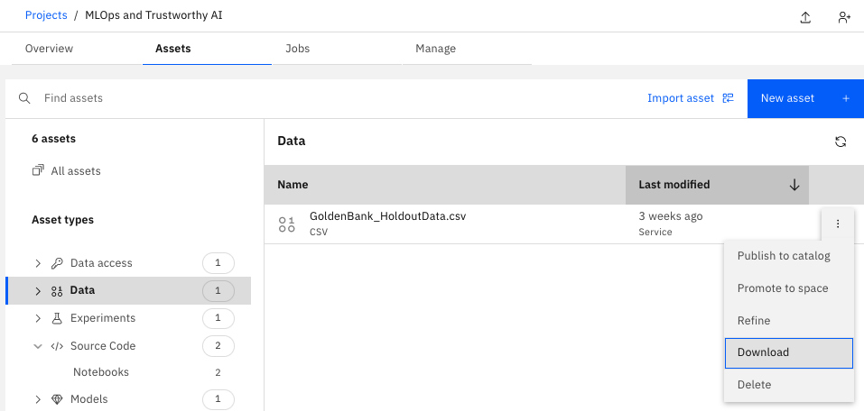
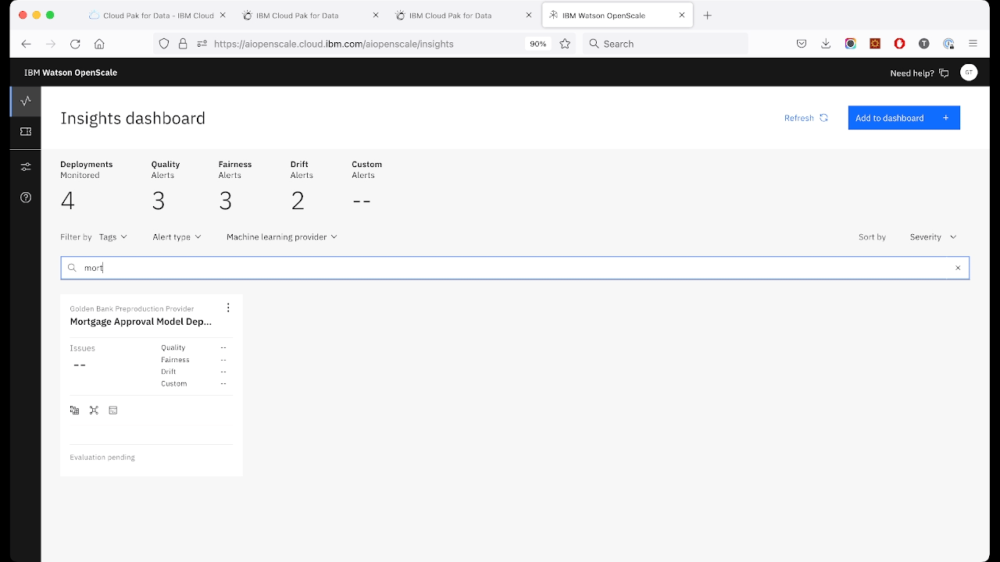
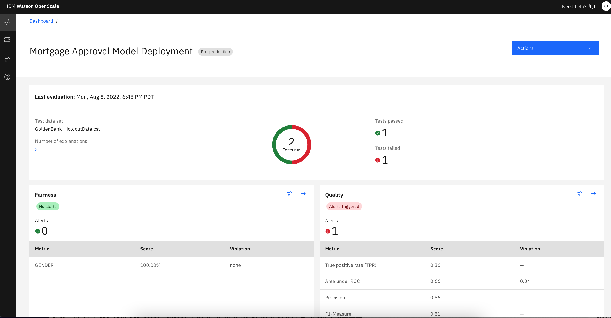

# Monitor a model for quality and fairness using Watson Openscale Service

## Tutorial Scenario
Golden Bank is a leading mortgage provider through their network of neighborhood branches. This tutorial cover these goals:
- The bank uses AI to process loan applications and needs to avoid unanticipated risk and ensure that its applicants are being treated fairly.
- Based on a new regulation, the bank cannot lend to underqualified loan applicants. The bank has existing data for loan applications in a Db2 Warehouse. The bank has used the data to train and deployed the AI model.
- The bank wants to monitor the model for quality, fairness, and explainability to avoid unanticipated risk and treat all applicants fairly.

## Exercise: Prepare the Service
1. Create the required services for the exercise
    1. Log into your IBM Cloud account.
    2. From the navigation menu at the top left corner, scroll down and choose **Cloud Pak for Data > Services**.
    3. Click **Launch Cloud Pak for Data**.
    4. From the Cloud Pak for Data navigation menu, choose **Services > Service instances**.
    5. Use the **Product** drop-down list to determine whether there is an existing Watson Studio service instance.
    6. If you need to create a Watson Studio service instance, click **Add service**.
    7. Select **Watson OpenScale**
        1. Select **Dallas** as the region.
        2. Select the **Lite** plan.
        3. Click **Create**.
    8. Repeat these steps to verify or provision the following additional services
        - **Watson OpenScale**
        - **Watson Knowledge Catalog**
        - **Cloud Object Storage**
2. Verify you have the Watson-OpenScale-xx service instance like the image.

    

## Exercise: Create Project
1. If you have not created the project create the sample project for the exercise.
    1. Login to IBM Cloud and access the [MLOps and Trustworthy AI guided tutorial sample project](https://dataplatform.cloud.ibm.com/exchange/public/entry/view/48e9f342365736c7bb7a8dfc48e6245e?context=cpdaas) in the gallery.
    2. Click **Create project**.
    3. Take the default name and select a Cloud Object Storage instance from the list.
    4. Click **Create** and then **View new project** to verify that the project and assets were created successfully.
2. Verify your project looks like the following image.

    

## Exercise: Create Monitor for fairness, quality, and explainability from a Notebook.

1. Make sure you have trained, deployed, and Promoted a model into a Deployment space. This exercise assumed you have completed the [build and deploy with autoai](../build-and-deploy-with-autoai/README.md) or the [build and deploy with watson studio](../build-and-deploy-with-studio/README.md) tutorial.

2. Locate the `monitor-wml-model-with-watson-openscale` Notebook under `Source Code` in the the `MLOps and Trustworthy AI` project that you have created in the previous exercise under the `Assets` tab.

    

3. Once the Notebook is opened, it is read only mode. Click on Edit to instantiate the Notebook for editing.

    

    Note: If the `ibmcloud_api_key` is empty click here to [create](https://cloud.ibm.com/iam/apikeys) one and paste it to the Notebook.

    

    Note: You may need to change the following variables in the Notebook if you have not named the deployment as instructed in the [build and deploy with watson studio](../build-and-deploy-with-studio/README.md) tutorial.

    

4. Create the monitor using the Notebook:
   a. Select Cell > Run all and wait for all the cells to finish running without error.

   b. Shutdown the Notebook instance. File > Stop kernel.

5. Open the OpenScale [Dashboard](https://aiopenscale.cloud.ibm.com/aiopenscale/insights) and verify you have something like:

    

6. Go the `MLOps and Trustworthy AI` project and download the `GoldenBank_HoldoutData.csv` under the Assets tab and Data assets.

    

7. On the [Dashboard](https://aiopenscale.cloud.ibm.com/aiopenscale/insights), click on the cell to display the monitor. Click on Action > Evaluate Now > Choose the option `from CSV` in the drop down menu to browse the holdout data you have downloaded in the previous step. Click `Upload and evaluate`.

    

8. Wait for the evaluation to complete and verify you have something like:

    
