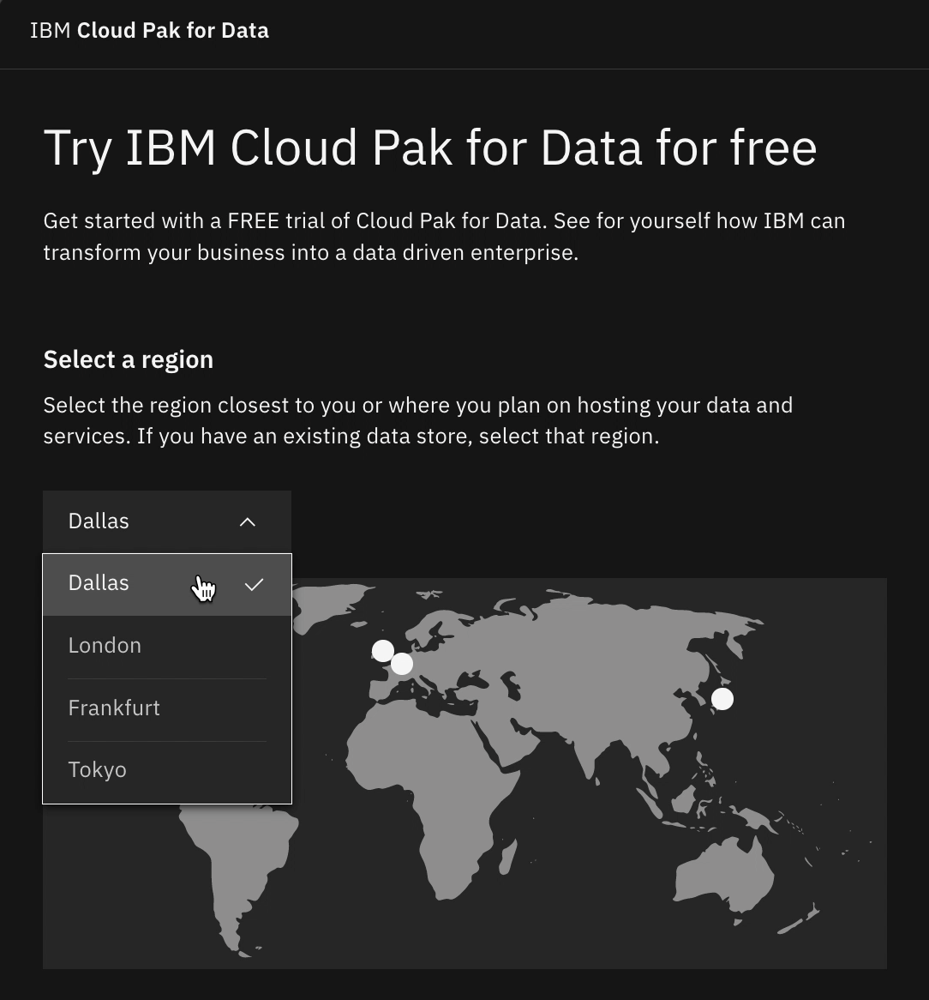
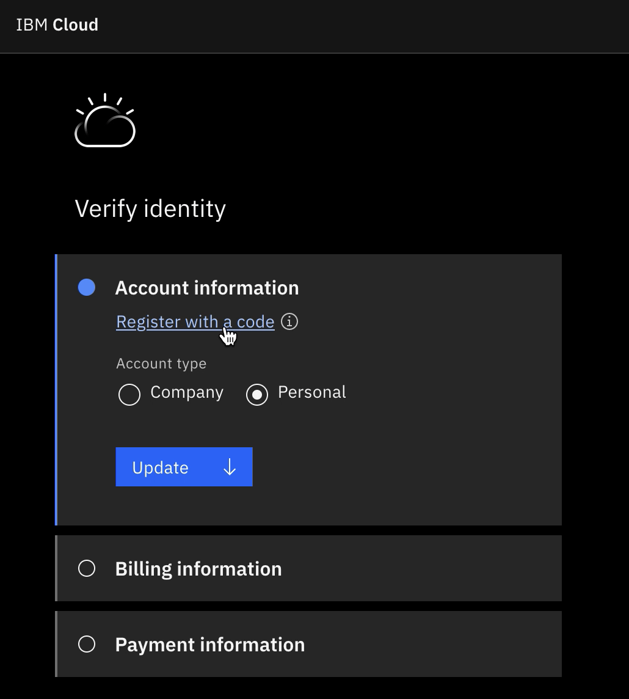
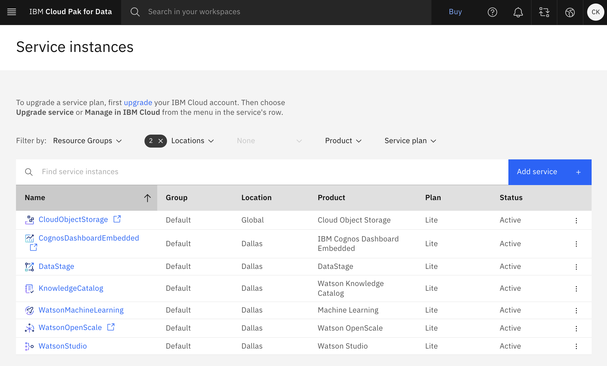

# Sign up for Cloud Pak for Data

## Prerequisites

You will need an email account to receive account creation verification code.
The email account must not have been used before for any IBM cloud 
services and should not be a corporate email like `*@ibm.com`.

## Create a Trial Account

 1. Open Cloud Pak for Data at [https://www.ibm.com/products/cloud-pak-for-data](https://www.ibm.com/products/cloud-pak-for-data)
 2. Click on "[Try it free](https://dataplatform.cloud.ibm.com/registration/stepone?context=cpdaas&apps=all)" which will open a new page 
 3. Under "**Select a region**" select "**Dallas**"
    
 5. In the bottom right corner, select the "I agree to the terms ..." check box and 
    click "**Create an IBM Cloud account**"
 6. On the next page, follow the dialog to enter your account information including
    name, address and phone number
 7. Accept the terms and conditions and click "Continue"
 8. Acknowledge the data privacy rules and click "Continue"
 9. Wait while your account is being created
 10. On the page to Verify your identity, click on "**Register with a code**"
     
 11. Enter your promo code and click on "Create account"
 12. Wait while your services are being provisioned 
 13. Click on "**Go to IBM Cloud Pak for Data**"
 14. On the "Welcome to Cloud Pak for Data!" screen click "Skip for now"
 15. From the navigation menu in the top left corner, select "**Services > [Service instances](https://dataplatform.cloud.ibm.com/data/services?target=services&context=cpdaas)**"
 16. Verify the following services got created:
     - "**CloudObjectStorage**"
     - "**DataStage**"
     - "**KnowledgeCatalog**"
     - "**WatsonMachineLearning**"
     - "**WatsonOpenScale**"
     - "**WatsonStudio**"
 
     Compare to the screenshot below:
     

The trial period is 30 days. After the trial period ends, you will be able to
transfer to a paid subscription or pay-as-you-go model.
