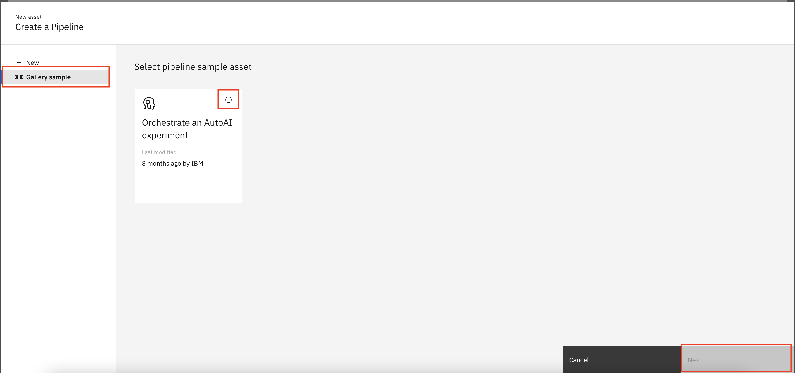
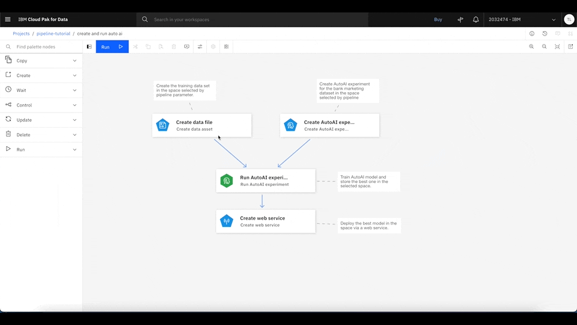
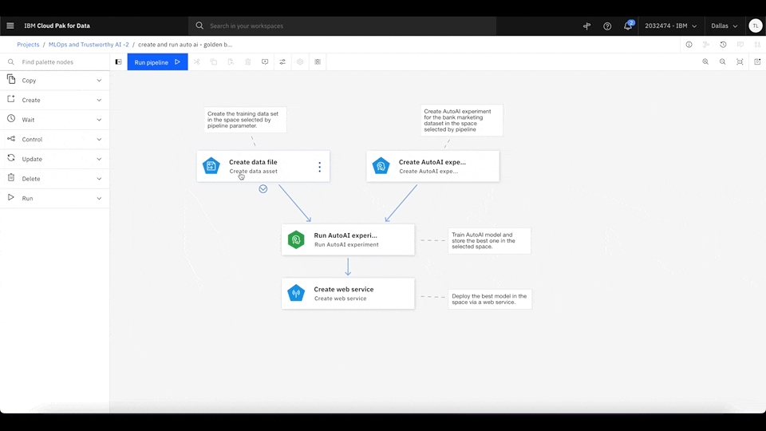
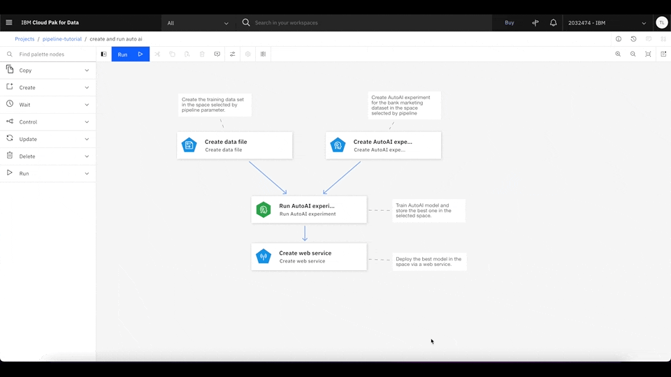
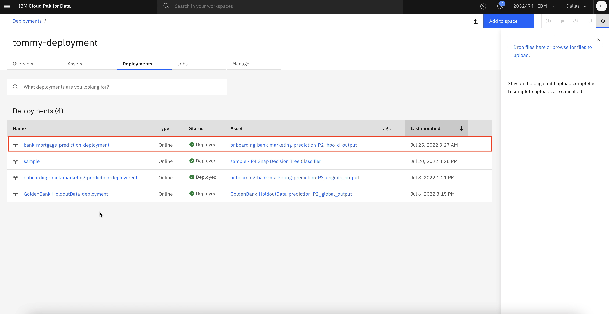
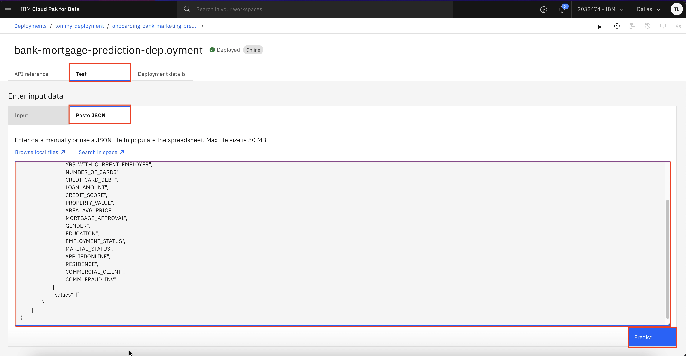
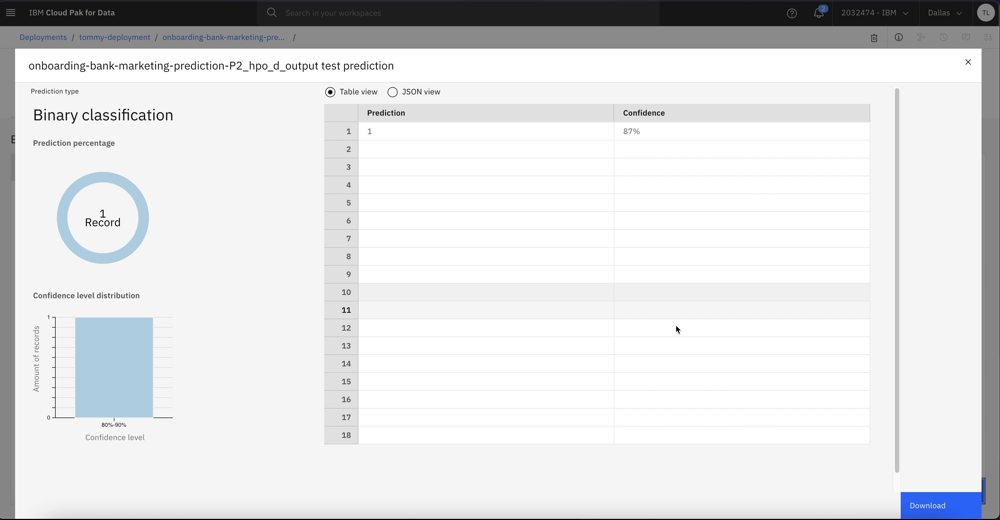

# Automate the Machine Learning Lifecycle

1. Create and run Pipeline assets.
    
    

2. Under New asset, select Pipelines.
    
    

3. After selecting the Pipeline asset, choose the gallery `sample Orchestrate an AutoAI experiment`, then click **Next**. This sample uses a data set from the project asset to train multiple models with hyperparameter optimization by using AutoAI. It then deploys the best-selected model into production on a web service by using the Watson Machine Learning Service.
    
    

4. Enter any name for the new pipeline, and click **Create**.
    
    

5. You should see the AutoAI pipeline example. Inside Watson Studio Pipeline, you can drag and drop any node, connect them, and modify them in the UI. You can also add comments to any node so that others can understand what each node is doing inside the pipeline.
    
    

6. Update the pipeline example to use the golden bank dataset and update the AutoAI experiment with the golden bank dataset prediction column as below.

    6.1. First change the data source of **Create data file** to `GoldenBank_HoldoutData.csv`

    6.2. Update the **Create AutoAI experiment** to predict on the column `LOANS` with positive label as `1` for the new golden bank dataset.

    6.3. Update the **Create web service** to store the deployed model as `bank-mortgage-prediction-deployment` to distinguish this model in the deployment space. 
    
    

7. To run the pipeline, click Run, and select Trial run. Then, select the desired deployment space to serve the best machine learning model. If you don't have a deployment space, follow the next step by clicking the upper left, and select Deployments. Then, you can create a new deployment space. 

    This pipeline downloads the data set from the shared object storage and creates an AutoAI experiment to train multiple machine learning models. It then finds the best machine learning model based on the experiment result and deploys it as a web service using Watson Studio deployment.

    

8. After the pipeline is finished, you can go to the deployments page and look at the model deployment details. Click the upper left to open the side menus and select **Deployments**.
    
    

9. Click the **Spaces** tab, and select the space where your model is deployed to.
    
    

10. Click **Deployments**, and you can see all of the active models in this space. Then, select the most recent model that you just deployed.
    
    

11. Click the **Test** tab, and use the following example payload to test the deployed model. You see that this model can be interacted with as a web service and returns the prediction result along with the confident rate details.
    
    

    ```
    {"input_data":[{"fields":["INCOME","YRS_AT_CURRENT_ADDRESS","YRS_WITH_CURRENT_EMPLOYER","NUMBER_OF_CARDS","CREDITCARD_DEBT","LOAN_AMOUNT","CREDIT_SCORE","PROPERTY_VALUE","AREA_AVG_PRICE","LOANS","GENDER","EDUCATION","EMPLOYMENT_STATUS","MARITAL_STATUS","APPLIEDONLINE","RESIDENCE","COMMERCIAL_CLIENT","COMM_FRAUD_INV"],"values":[[100000,5,10,1,2000,60000,780,460000,420000,0,"Male","College","Employed","Married","YES","Private Renting","TRUE","FALSE"]]}]}
    ```

    As you can see, the model predicts that the client most likely will approve the mortgage loan.
    
    