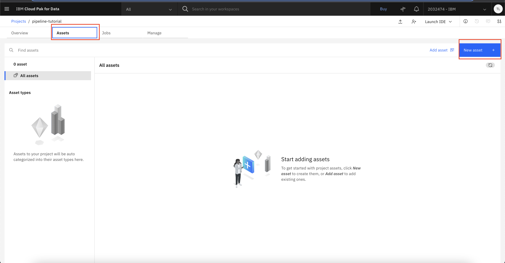
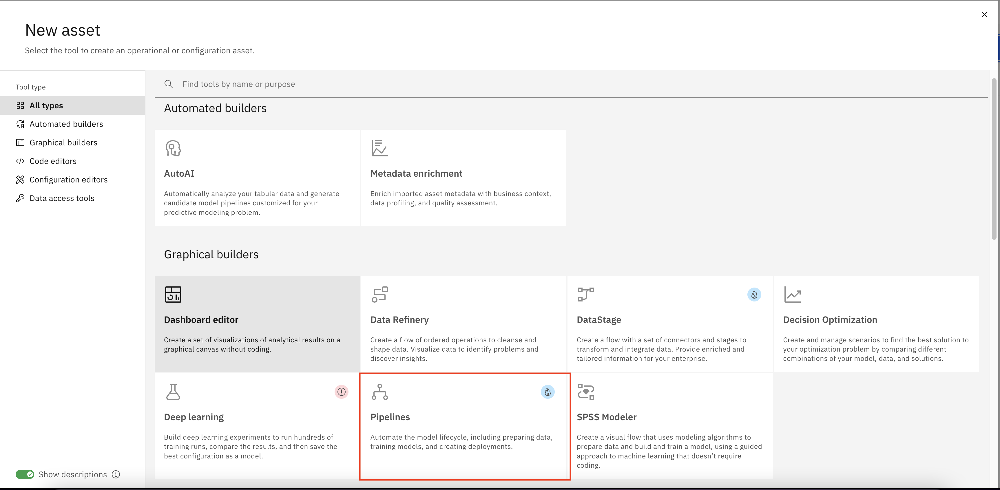
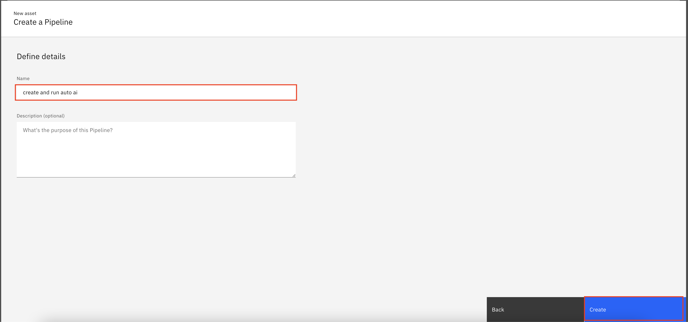
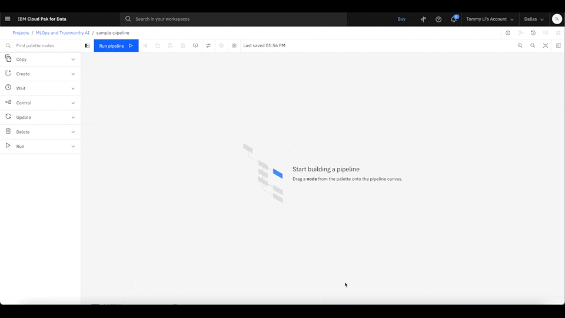
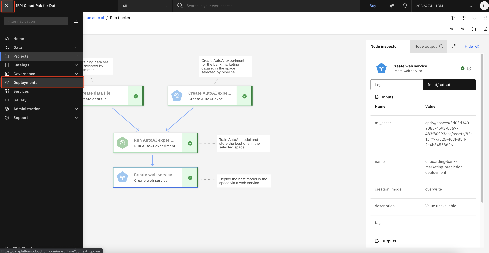
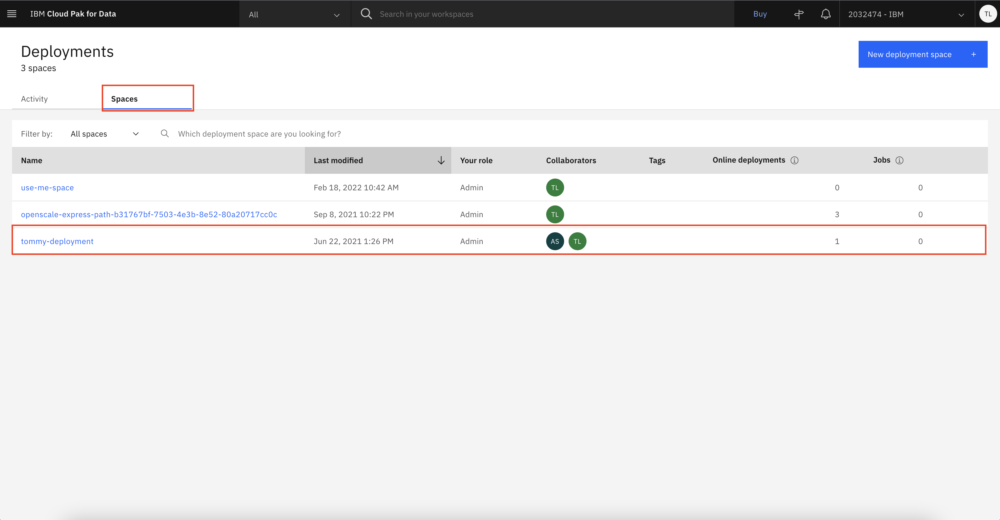

# Automate the Machine Learning Lifecycle

1. Create and run Pipeline assets.
    
    

2. Under New asset, select Pipelines.
    
    

3. After selecting the Pipeline asset, enter any name for the new pipeline, and click **Create**.
    
    

4. Now we want to create a simple pipeline that creates a new Watson Studio deployment space, and move our project data to the new deployment space so other services and user those data for their model predictions or perform fairness evaluations.

    4.1. Click the **Create** Panel on the left hand side to expand it. Then drag the **Create Deployment Space** icon to the right hand side.

    4.2. Double click on the **Create Deployment Space**, enter any name for your new deployment space. Then select the service for both **New space COS Instance CRN** and **New space WML Instance CRN**

    4.3. Now drag the **Create data file** icon to the right hand side, connect the **Create Deployment Space** node to the **Create data file** node.

    4.4. Double click on the **Create data file**, click **Select file** and pick any file you want inside your project. Then click on the icon next to **Target Scope** and pick **Select from another node**. Then pick **Create Deployment Space** in the new drop down menus.
    
    

5. To run the pipeline, click Run, and select Trial run. Then, the pipeline will create a new deployment space for you can upload the project dataset to the same deployment space.

    

6. After the pipeline is finished, you can go to the deployments page and look at the model deployment details. Click the upper left to open the side menus and select **Deployments**.
    
    

7. Click the **Spaces** tab, and select the space where your dataset is uploaded to.
    
    

